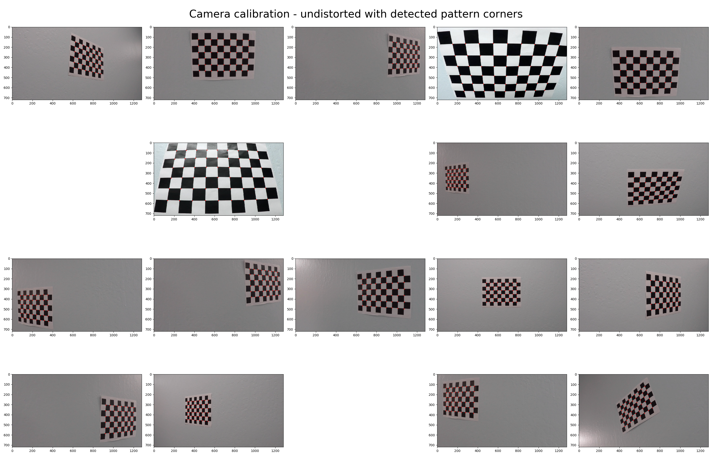
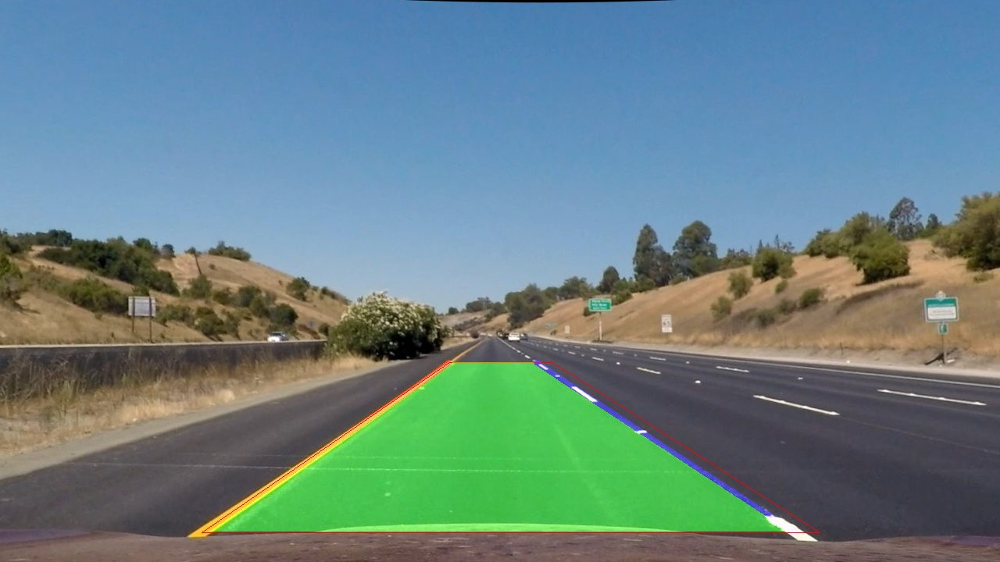

## Writeup Template

---

**Advanced Lane Finding Project**

The goals / steps of this project are the following:

* Compute the camera calibration matrix and distortion coefficients given a set of chessboard images.
* Apply a distortion correction to raw images.
* Use color transforms, gradients, etc., to create a thresholded binary image.
* Apply a perspective transform to rectify binary image ("birds-eye view").
* Detect lane pixels and fit to find the lane boundary.
* Determine the curvature of the lane and vehicle position with respect to center.
* Warp the detected lane boundaries back onto the original image.
* Output visual display of the lane boundaries and numerical estimation of lane curvature and vehicle position.
## [Rubric](https://review.udacity.com/#!/rubrics/571/view) Points

### Here I will consider the rubric points individually and describe how I addressed each point in my implementation.

---

### Camera Calibration

The function is implemented in `python/camera_calibration.py`

I start by preparing "object points", which will be the (x, y, z) coordinates of the chessboard corners in the world. Here I am assuming the chessboard is fixed on the (x, y) plane at `z=0`, such that the object points are the same for each calibration image. The object points are generated in `_generate_object_points` and it's a 3D array has the same length of total number of images.

Then I load the images using `load_images` given `image_path` to read all of the images for camera calibration and run `detect_chess_board_corners` on them to get the images points. The return array is a 3D array and containing a list of image points (coming from all images).

Then the final step is to feed the obejct points and images points into `cv2.calibrateCamera` to get the final camera matrix `KK` and distortion coefficents `Kc`.

TODO: Generate result image and provide image links.

After I got the camera KK and Kc, I implemented a function `undistort_images` to undistort all images and return a list of undistorted images.


I save the camera KK and Kc in a file called `camera.json` and will use it the actual lane detection pipeline.

Camera matrix json
```json
{
 "KK": [
  [
   484.3902884693779,
   0.0,
   359.50000343668137
  ],
  [
   0.0,
   730.5665190852465,
   639.4999981458845
  ],
  [
   0.0,
   0.0,
   1.0
  ]
 ],
 "Kc": [
  [
   -0.04327892605564115,
   0.00008322703351661759,
   -0.008936257678709005,
   0.024703269877233883,
   2.5638661810637675e-7
  ]
 ]
}
```




### Pipeline (single images)

All related code of the lane detection pipeline is located in `python/lane_detection.py`

#### 1. Provide an example of a distortion-corrected image.

Here is an undistorted image using camera KK and Kc in `camera.json`.

TODO: Provide undistorted image

#### 2. Preprocessing
The purpose of this step is to find the proper binary image for later processing.
This step is implemented in `lane_detecion`.

The first step is to examine the color spaces to see if we can find a channel of a particular color space where lane line is visually outstanding. After plotting all hls and hlv color spaces, I chose saturation channel in hls image.

Then I used canny to find out the edges in canny images.

TODO: Provide image links

#### 3. Image warping

Later in the function `lane_detection` after color transformations, I have used a function called `get_homography` to get the homogray between the lane ROI corners in the original perspective image and a target top view warped image.

Source ROI corners are defined as `ROI_CORNERS` and dest (warped) ROI corners are defined as `WARPED_ROI_CORNERS` and used in `get_homograpghy`.

Then I apply this warping transform to canny image to get a warped image, where the main lane searching function will run on.

TODO: Provide images.

#### 4. Lane searching and polynomial fitting

It's implemeted in function `search_lane`.

TODO: Provide more details and images.

#### 5. Curvature calculation

It's implemented in function `measure_curvature_pixels`.

#### 6. Final result output



---

### Pipeline (video)

#### 1. Final result outputs

Here's a [link to my video result](./output_images/project_video.mp4)

---

### Discussion

TODO